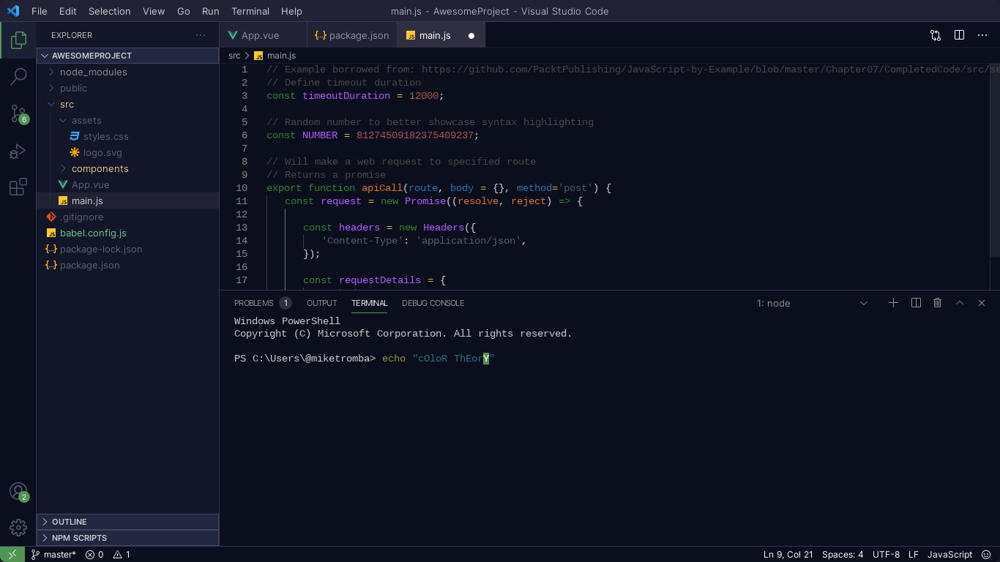

# Husky Theme for VSCode

[](https://marketplace.visualstudio.com/items?itemName=luas10c.vscode-husky-theme)
[]([downloads](https://marketplace.visualstudio.com/items?itemName=luas10c.vscode-husky-theme))
[](https://marketplace.visualstudio.com/items?itemName=luas10c.vscode-husky-theme)
[](https://github.com/prettier/prettier)
[](https://github.com/eslint/eslint)

### Preview Theme
&nbsp;
[](https://marketplace.visualstudio.com/items?itemName=luas10c.vscode-husky-theme)

[&nbsp;&nbsp;&nbsp;&nbsp;&nbsp;](https://marketplace.visualstudio.com/items?itemName=luas10c.vscode-husky-theme) 

&nbsp;
> ### To build the theme follow the steps below
```zsh
npm run build
```