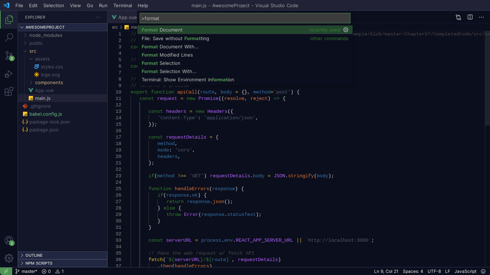

<h1 align="center">
<br>

<br>
<br>
 Husky Theme for VSCode
 <br>
 </h1><br>
<p align="center">
<a href="https://marketplace.visualstudio.com/items?itemName=luas10c.vscode-husky-theme">
</a>

<a href="https://marketplace.visualstudio.com/items?itemName=luas10c.vscode-husky-theme">

</a>

<a href="https://marketplace.visualstudio.com/items?itemName=luas10c.vscode-husky-theme">

</a>
</p>

### Preview Theme




&nbsp;
> ### To build the theme follow the steps below
```zsh
npm run build
```